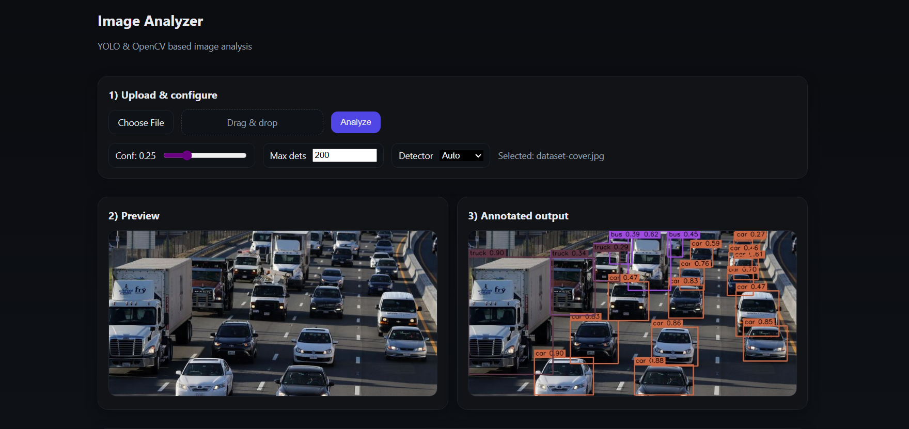

# Image Analyzer (FastAPI + React + YOLO/Contour)

## What is Image Analyzer?
Upload a picture and get an instant result with boxes drawn around the detected objects. You also see simple stats for each box (size, a small brightness chart), and you can revisit or delete past uploads in History.

### What do Frontend & Backend do?

- Frontend (React): clean UI to upload images, choose detector (Auto / YOLO / Contour), adjust confidence & max detections, view results and history.

- Backend (FastAPI): receives the image, runs detection, computes stats, draws boxes, saves files, and exposes simple APIs for analysis and history.

### How are objects detected?

- YOLO: a neural network trained on many labeled images that proposes boxes with names (e.g., “cat”) and confidence scores.

- Contour: classic computer vision that finds prominent shapes by edges/contrast; fast and works without large models (great fallback in Auto mode).



---

## ⚙️ Installation

> You can run with **Docker** or **locally**. Pick one.

### Option A — Docker

```bash
docker compose up --build
# Backend:  http://localhost:8000/docs
# Frontend: http://localhost:3000
```

> Don’t commit model weights. Use `.env` → `MODEL_WEIGHTS=yolov8n.pt` (or point to your own file).

### Option B — Local setup

**Backend**
```bash
cd Backend
python -m venv .venv
pip install -r requirements.txt
copy .env.example .env  
uvicorn app.main:app --reload --host 0.0.0.0 --port 8000
```

**Frontend**
```bash
cd Frontend
npm install
npm run dev
# open http://localhost:3000
```

---

## 🚀 Usage (UI)

1. **Upload** an image (drag & drop or file picker).  
2. Choose **Detector** (Auto / YOLO / Contour), tweak **Confidence** / **Max detections** if needed.  
3. Click **Analyze** → annotated image appears on the right, **detections** listed below.  
4. Open **History** to view recent uploads, **Preview** or **Delete** items.

---

## 🔌 API Endpoints (Backend)

Swagger UI: **http://localhost:8000/docs**

- `POST /api/v1/analyze`
  - Query: `detector=auto|yolo|contour`, `conf`, `max_dets`
  - Body: `multipart/form-data` with `file` (image)
  - Returns: detections + `annotated_url` + `history_id`

- History
  - `GET    /api/v1/history`
  - `GET    /api/v1/history/{id}`
  - `DELETE /api/v1/history/{id}`
  - `DELETE /api/v1/history`

- Debug
  - `GET /api/v1/debug/version`
  - `GET /api/v1/debug/config`

- Diagnostics
  - `POST /api/v1/analyze_smoke`  (save only)
  - `POST /api/v1/analyze_min`    (contour‑only)

---

## 🗂️ Project Structure

```plaintext
Image-Analyzer-YOLO/
├── Backend/
│   ├── app/
│   │   ├── api/
│   │   │   └── v1/ (endpoints.py, schemas.py)
│   │   ├── core/ (config.py)
│   │   ├── models/ (detection.py)
│   │   ├── services/ (inference.py, analytics.py)
│   │   └── utils/ (storage.py, visualize.py, history.py)
│   ├── tests/
│   ├── Dockerfile
│   ├── requirements.txt
│   └── uploads/               
├── Frontend/
│   ├── src/
│   │   ├── App.jsx
│   │   ├── index.jsx
│   │   ├── services/
│   │   │   └── api.js
│   │   └── styles/
│   │       └── global.css
│   ├── index.html
│   ├── package.json
│   ├── package-lock.json
│   └── vite.config.js                 
├── docker-compose.yml        
├── README.md
└── LICENSE
```

---

## 🔧 Configuration

`Backend/.env`

```env
UPLOAD_DIR=uploads
CORS_ORIGINS=["http://localhost:3000"]
DETECTOR=auto             
MODEL_WEIGHTS=yolov8n.pt
SECRET_KEY=change-me
```
---

## 🧰 Troubleshooting

- **500 errors?** Try `analyze_smoke` (checks saving) then `analyze_min` (Contour path).
- **CORS issues?** Ensure `.env` → `CORS_ORIGINS=["http://localhost:3000"]`.
- **Endpoints missing in /docs?** Check `include_router` and server reload.
- **YOLO/Torch missing?** Set `DETECTOR=contour` (Auto will fallback anyway).

---

## License

MIT
