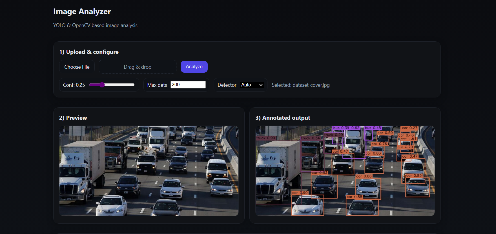

# Image Analyzer (FastAPI + React + YOLO/Contour)

Upload a picture and get boxes around the detected objects, plus a few stats for each box. Past uploads stay in History, where you can open or delete them.

Frontend is a React page: upload, pick Auto / YOLO / Contour, change confidence and max detections, then look at the result. Backend is FastAPI. It stores the file, runs detection, draws the boxes and serves the history API.

YOLO is a model trained on labeled images. It returns a name and a confidence for each box. Contour is plain OpenCV: edges and shapes, no weights. Auto tries YOLO first and falls back to contour if that fails.



## Run it

Docker:

```bash
docker compose up --build
```

Backend docs: http://localhost:8000/docs  
Frontend: http://localhost:3000

Do not commit model weights. In `.env` set `MODEL_WEIGHTS=yolov8n.pt`, or point it at your own file.

Without Docker, backend:

```bash
cd Backend
python -m venv .venv
pip install -r requirements.txt
uvicorn app.main:app --reload --host 0.0.0.0 --port 8000
```

Frontend, from `Frontend/`:

```bash
npm install
npm run dev
```

Open http://localhost:3000.

## Usage

Upload an image, pick a detector, tweak confidence or max detections if you want, then Analyze. The annotated image shows on the right and the detections are listed under it. History is the same list later: preview or delete.

## API

Swagger is at http://localhost:8000/docs.

`POST /api/v1/analyze`  
Query: `detector=auto|yolo|contour`, `conf`, `max_dets`  
Body: multipart form with `file`  
Returns detections, `annotated_url` and `history_id`.

History:

- `GET /api/v1/history`
- `GET /api/v1/history/{id}`
- `DELETE /api/v1/history/{id}`
- `DELETE /api/v1/history`

## Project structure

```
Image-Analyzer-YOLO/
├── Backend/
│   ├── app/
│   │   ├── api/v1/          endpoints.py, schemas.py
│   │   ├── core/            config.py
│   │   ├── models/          detection.py
│   │   ├── services/        inference.py, analytics.py
│   │   └── utils/           storage.py, visualize.py, history.py
│   ├── tests/
│   ├── Dockerfile
│   ├── requirements.txt
│   └── uploads/
├── Frontend/
│   ├── src/
│   ├── index.html
│   ├── package.json
│   └── vite.config.js
├── docker-compose.yml
├── README.md
└── LICENSE
```

## Configuration

`Backend/.env`

```
UPLOAD_DIR=uploads
CORS_ORIGINS=["http://localhost:3000"]
DETECTOR=auto
MODEL_WEIGHTS=yolov8n.pt
```

## If something fails

CORS errors usually mean `CORS_ORIGINS` does not include `http://localhost:3000`.  
If `/docs` is missing routes, check that `include_router` is still in `main.py` and that uvicorn reloaded.  
No torch or no weights: set `DETECTOR=contour`. Auto already falls back when YOLO cannot start.

## License

MIT. See [LICENSE](LICENSE).
